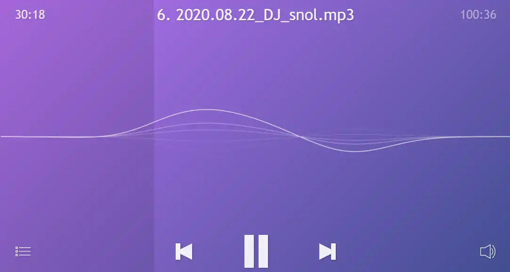
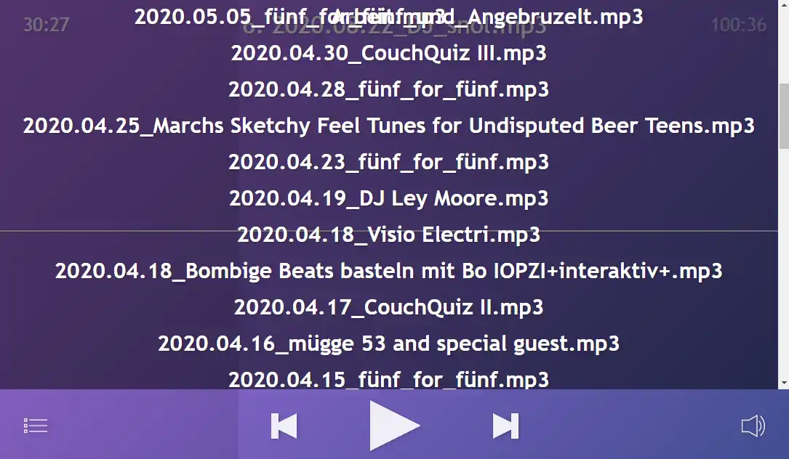

# directoryListingAudioPlayer
An [howler.js](https://github.com/goldfire/howler.js) based audio player that dynamically creates playlist from an Nginx directory listing json file.

## Based on howler.js
99% based on the example code from [howler.js](https://github.com/goldfire/howler.js)

But I made it parse the json from an Nginx Directory Listing.

## Setup

Create a directory listing with an alias where you audio files are located.
```
location /myAudioFiles/json {
        alias /var/www/html/audio;
        autoindex_exact_size off;
        autoindex on;
        autoindex_format json;
        charset utf-8;
}
```

Create another location with an URL where you want the player to be reachable, and an alias to where the files are located.

`git clone https://github.com/lord-carlos/directoryListingAudioPlayer.git`

Edit the `player.js` and change `jsonUrl = ''` to where the files are located. For example `var jsonUrl = "https://example.com/myAudioFiles/json";`
Optional change `reverse` to false. If `true` the playlist will be reversed from the directory listing.

## Motivation

I wanted something super simple to share audio files. Better then normal directory listing where the browser creates a minimal player, but not as big as Airsonic, Funkwhale or Jellyfin. 

## missing

* Direct linking a specific song.
* clean code 😶

## Known bugs

* Current track time and progress bar sometimes don't work after seek. It's a problem with the upstream framework.

## Screenshots

Player


Playlist
